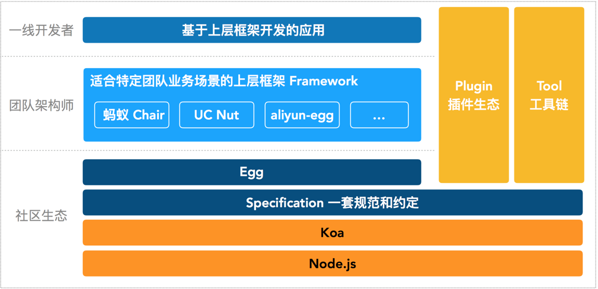

### Egg.js 官网

- 官 网：https://eggjs.org
- 中文网站：https://eggjs.org/zh-cn/

### Egg.js 是什么

- Egg.js 是《阿里旗下产品》基于 Node.js 和 Koa 是一个 Nodejs 的企业级应用开发框架。可以帮助发团队和开发人员降低开发和维护成本。

- Express 和 Koa 是 Node.js 社区广泛使用的框架，简单且扩展性强，非常适合做个人项目。但框架本身缺少约定，标准的 MVC 模型会有各种千奇百怪的写法。Egg 按照约定进行开发，奉行『约定优于配置』，团队协作成本低。

- Egg.js 基于 Es6、Es7 以及 Typescript、Koa2 使得 Nodejs 具有更规范的开发模式、更低的学习成本、更优雅的代码、更少的开发成本、更少的维护成本。为企业级框架而生。

### Egg.js 的特性

- 提供基于 Egg 定制上层框架的能力
- 高度可扩展的插件机制
- 内置多进程管理
- 基于 Koa 开发，性能优异
- 框架稳定，测试覆盖率高
- 渐进式开发

### Egg.js 的历史

- 2013 年蚂蚁的 chair 框架，可以视为 egg 的前身。
- 2015 年 11 月，在苏千的召集下，阿里各 BU 的前端骨干齐聚黄龙，闭门共建。
- 2016 年初，各 BU 的基础 web 框架完成升级，在同一套规范的基础上进行差异化定制。
- 2016 年中，广泛使用在绝大部分阿里的前端 Node.js 应用。
- 2016 年 09 月，在 JSConf China 2016 上亮相并宣布开源。
- 2017 年初，官网文档 egg - 为企业级框架和应用而生 亮相，并将在本月发布 egg@1.0版本。
- 2017 年 12 月左右 Egg 社区版 2.0 正式发布，性能提升 30%，基于 koa2 拥抱 Async
- 2018 年 7 月最新 egg 的版本是 2.2.1
- 经过几年的沉淀 Egg 已经非常成熟,下面让我们一起开启 Egg 的学习之旅。

### Egg.js在阿里的地位

    

### Egg 快速入门、搭建环境、创建项目

1 ) **环境准备**

操作系统：支持 macOS，Linux，Windows
运行环境：Nodejs 建议选择 LTS 版本，Nodejs 最低要求 8.x

2 ） **安装 egg 脚手架以及使用 egg-init 创建项目**

我们推荐直接使用脚手架，只需几条简单指令，即可快速生成项目:

$ `npm i egg-init -g`
$ `egg-init egg-example --type=simple`
$ `cd egg-example`
$ `npm i`

启动项目:

$ `npm run dev`
$ `open localhost:7001`

