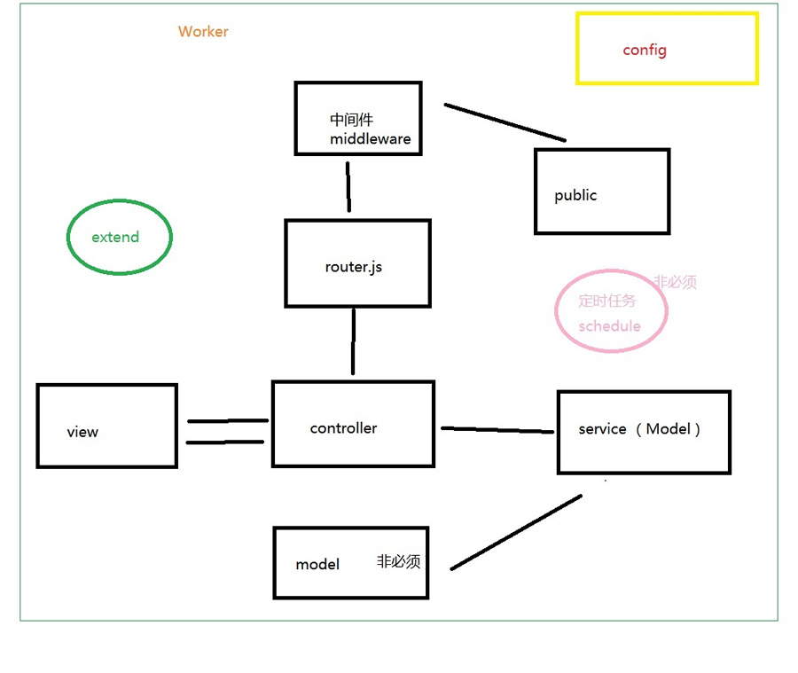

### Egg.js 目录结构

<div align="center">
    
</div>

- 这个是比较简单的目录结构，简要做下介绍，当然还可以创建其他文件，一般如下说明
- `app` 项目开发目录
- `config` 项目配置文件
- `logs` 日志文件
- `run` 项目运行配置文件
- `test` 测试文件
- .autod.conf.js、.eslintignore、.eslintrc、.gitignore、.travis.yml、appveyor.yml 这些是运行配置文件
- package.json 项目配置文件 管理项目模块等元数据

### Egg.js 目录约定规范

由于express、koa缺少约定和规范，MVC的实现可以千奇百怪，eggjs对MVC进行了约定和规范

```tree
egg-project
├── package.json
├── app.js (可选)
├── agent.js (可选)
├── app
│   ├── router.js
│   ├── controller.js
│   │   └── home.js
│   ├── service.js
│   │   └── my_task.js
│   ├── public(可选)
│   │   └── reset.css
│   └── view(可选)
│   │   └── home.tpl
│   └── extend(可选)
│       ├── helper.js (可选)
│       ├── request.js (可选)
│       ├── response.js (可选)
│       ├── context.js (可选)
│       ├── application.js (可选)
│       └── agent.js
├── config
│   ├── plugin.js
│   ├── config.default.js
│   ├── config.prod.js
│   ├── config.test.js (可选)
│   ├── config.local.js (可选)
│   └── config.unittest.js (可选)
├── test
│   ├── middleware
```

### MVC 架构

<div align="center">
    
</div>

egg是一个mvc框架

- model 模型 和数据打交道(查询数据库，请求数据)，存放于service目录中
- view 视图模板页面的展示
- Controller控制器 负责处理业务逻辑