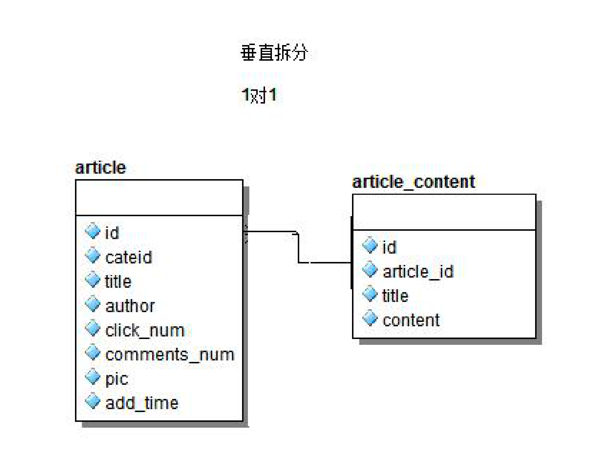
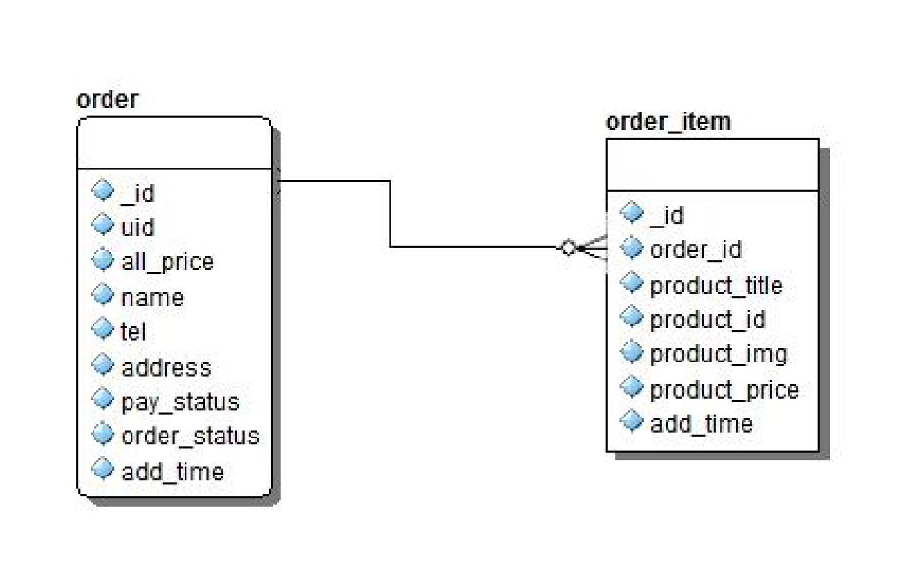
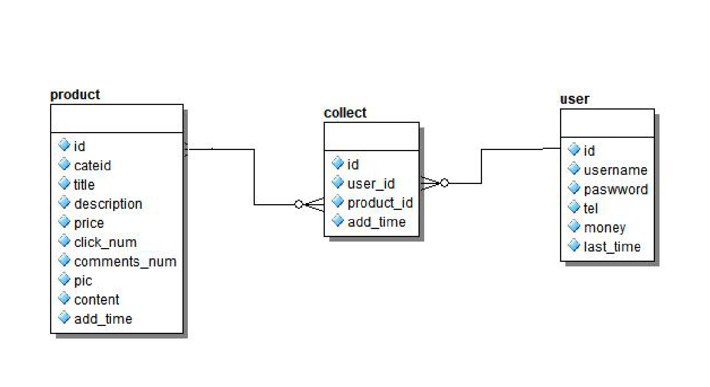

### 关系数据库中表与表的 3 种关系

1）**一对一的关系**

例如：一个人对应一个唯一的身份证号，即为一对一的关系。

    

一篇文章对应一个文章详情, 本来可以是一张表，拆分成2张表

2）**一对多关系**

例如：一个班级对应多名学生，一个学生只能属于一个班级，即为一对多关系

    

一个分类，有多个商品，一个商品只属于1个分类，再比如：订单表和商品表是一对多的关系

3）**多对多关系**

例如：一个学生可以选多门课程，而同一门课程可以被多个学生选修，彼此的对应关系，即是多对多关系

    

商品表和用户表，一个用户可以收藏多个商品，一个商品可以被多个用户收藏
多对多的关系需要一张中间表来建立联系
