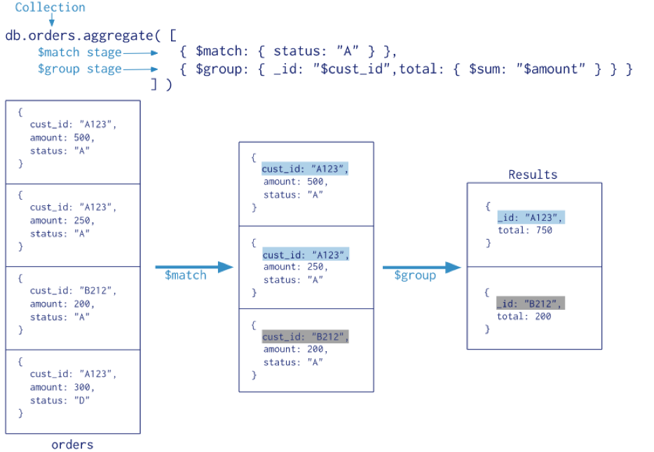

### MongoDB 聚合管道

- 聚合管道: Aggregation Pipeline
- 使用聚合管道可以对集合中的文档进行变换和组合
- 用于表关联查询、数据的统计
- MongoDB 中使用 `db.COLLECTION_NAME.aggregate([{<stage>},...])` 方法来构建和使用聚合管道
- 在特定版本的MongoDB中才能使用 versions >= 3.2
 
官网示例

<div align="center">
    
</div>

- 左侧orders是一个集合(类比关系型数据库中的表)，使用则是直接通过 `db.orders.aggregate()`来操作
- 参数中`$match`表示匹配state属性为A的数据，也就是说`$match`是个管道过滤出所有state为A的数据，得到一个集合
- 参数中`$group`表示根据cust_id属性进行分组，分完组后对属性amount进行求和，也就是说`$group`也是一个管道，得到我们想要的数据，在这里的`$sum`是求和的管道表达式

### MongoDB Aggregation 管道操作符与表达式

<table>
    <tr>
        <th>管道操作符</th>
        <th>Description</th>
    </tr>
    <tr>
        <td>$project</td>
        <td>增加、删除、重命名字段</td>
    </tr>
    <tr>
        <td>$match</td>
        <td>条件匹配，只满足条件的文档才能进入下一阶段</td>
    </tr>
    <tr>
        <td>$limit</td>
        <td>限制结果的数量</td>
    </tr>
    <tr>
        <td>$skip</td>
        <td>跳过文档的数量</td>
    </tr>
    <tr>
        <td>$sort</td>
        <td>条件排序</td>
    </tr>
    <tr>
        <td>$group</td>
        <td>条件组合结果、统计</td>
    </tr>
    <tr>
        <td>$lookup</td>
        <td>用以引入其它集合的数据（表关联查询）</td>
    </tr>
</table>

**SQL和NOSQL对比**

<table>
    <tr>
        <td>WHERE</td>
        <td>$match</td>
    </tr>
    <tr>
        <td>GROUP BY</td>
        <td>$group</td>
    </tr>
    <tr>
        <td>HAVING</td>
        <td>$match</td>
    </tr>
    <tr>
        <td>SELECT</td>
        <td>$project</td>
    </tr>
    <tr>
        <td>ORDER BY</td>
        <td>$sort</td>
    </tr>
    <tr>
        <td>LIMIT</td>
        <td>$limit</td>
    </tr>
    <tr>
        <td>SUM()</td>
        <td>$sum</td>
    </tr>
    <tr>
        <td>COUNT()</td>
        <td>$sum</td>
    </tr>
    <tr>
        <td>join</td>
        <td>$lookup</td>
    </tr>
</table>

**管道表达式**

- 管道操作符作为“键”,所对应的“值”叫做管道表达式。
- 例如`{$match:{status:"A"}}`，$match称为管道操作符，而status:"A"称为管道表达式，是管道操作符的操作数(Operand)。
- 每个管道表达式是一个文档结构，它是由字段名、字段值、和一些表达式操作符组成的。

<table>
    <tr>
        <th>常用表达式操作符</th>
        <th>Description</th>
    </tr>
    <tr>
        <td>$addToSet</td>
        <td>将文档指定字段的值去重</td>
    </tr>
    <tr>
        <td>$max</td>
        <td>文档指定字段的最大值</td>
    </tr>
    <tr>
        <td>$min</td>
        <td>文档指定字段的最小值</td>
    </tr>
    <tr>
        <td>$sum</td>
        <td>文档指定字段求和</td>
    </tr>
    <tr>
        <td>$avg</td>
        <td>文档指定字段求平均</td>
    </tr>
    <tr>
        <td>$gt</td>
        <td>大于给定值</td>
    </tr>
    <tr>
        <td>$lt</td>
        <td>小于给定值</td>
    </tr>
    <tr>
        <td>$eq</td>
        <td>等于给定值</td>
    </tr>
</table>

### 测试数据

```js
db.order.insert({"order_id":"1","uid":10,"trade_no":"111","all_price":100,"all_num":2})
db.order.insert({"order_id":"2","uid":7,"trade_no":"222","all_price":90,"all_num":2})
db.order.insert({"order_id":"3","uid":9,"trade_no":"333","all_price":20,"all_num":6})

db.order_item.insert({"order_id":"1","title":"商品鼠标1","price":50,num:1})
db.order_item.insert({"order_id":"1","title":"商品键盘2","price":50,num:1})
db.order_item.insert({"order_id":"1","title":"商品键盘3","price":0,num:1})

db.order_item.insert({"order_id":"2","title":"牛奶","price":50,num:1})
db.order_item.insert({"order_id":"2","title":"酸奶","price":40,num:1})

db.order_item.insert({"order_id":"3","title":"矿泉水","price":2,num:5})
db.order_item.insert({"order_id":"3","title":"毛巾","price":10,num:1})
```

- 运行之后，生成2个集合(表)：order、order_item, 可以查看, 类似下面这样
    ```shell
    > db.order.find()
    { "_id" : ObjectId("5e8081ec0d65769967186242"), "order_id" : "1", "uid" : 10, "trade_no" : "111", "all_price" : 100, "all_num" : 2 }
    { "_id" : ObjectId("5e8081ec0d65769967186243"), "order_id" : "2", "uid" : 7, "trade_no" : "222", "all_price" : 90, "all_num" : 2 }
    { "_id" : ObjectId("5e8081ec0d65769967186244"), "order_id" : "3", "uid" : 9, "trade_no" : "333", "all_price" : 20, "all_num" : 6 }
    > db.order_item.find()
    { "_id" : ObjectId("5e8081ec0d65769967186245"), "order_id" : "1", "title" : "商品鼠标1", "price" : 50, "num" : 1 }
    { "_id" : ObjectId("5e8081ec0d65769967186246"), "order_id" : "1", "title" : "商品键盘2", "price" : 50, "num" : 1 }
    { "_id" : ObjectId("5e8081ec0d65769967186247"), "order_id" : "1", "title" : "商品键盘3", "price" : 0, "num" : 1 }
    { "_id" : ObjectId("5e8081ec0d65769967186248"), "order_id" : "2", "title" : "牛奶", "price" : 50, "num" : 1 }
    { "_id" : ObjectId("5e8081ec0d65769967186249"), "order_id" : "2", "title" : "酸奶", "price" : 40, "num" : 1 }
    { "_id" : ObjectId("5e8081ec0d6576996718624a"), "order_id" : "3", "title" : "矿泉水", "price" : 2, "num" : 5 }
    { "_id" : ObjectId("5e8081ed0d6576996718624b"), "order_id" : "3", "title" : "毛巾", "price" : 10, "num" : 1 }
    > db.order_item.find({"order_id":"1"})
    { "_id" : ObjectId("5e8081ec0d65769967186245"), "order_id" : "1", "title" : "商品鼠标1", "price" : 50, "num" : 1 }
    { "_id" : ObjectId("5e8081ec0d65769967186246"), "order_id" : "1", "title" : "商品键盘2", "price" : 50, "num" : 1 }
    { "_id" : ObjectId("5e8081ec0d65769967186247"), "order_id" : "1", "title" : "商品键盘3", "price" : 0, "num" : 1 }
    ```
- 我们可以看到order与order_item是1对多的关系

### 管道操作符详解

1 ） **关于 $project**

- 修改文档的结构，可以用来重命名、增加或删除文档中的字段
- 要求查找order只返回文档中 trade_no和 all_price字段
- 我们之前使用的方式是
    ```js
    db.order.find({}, {"trade_no":1, "all_price":1})
    ```
    * 输出结果是
        ```shell
        > db.order.find({}, {"trade_no":1, "all_price":1})
        { "_id" : ObjectId("5e8081ec0d65769967186242"), "trade_no" : "111", "all_price" : 100 }
        { "_id" : ObjectId("5e8081ec0d65769967186243"), "trade_no" : "222", "all_price" : 90 }
        { "_id" : ObjectId("5e8081ec0d65769967186244"), "trade_no" : "333", "all_price" : 20 }
        ```
- 现在我们使用管道的方式
    ```js
    db.order.aggregate([
        {
            $project:{"trade_no":1, "all_price":1 }
        }
    ])
    ```
    * 输出显示
        ```shell
        # 这里筛选的数据，只显示order表中trade_no和all_price属性的数据
        > db.order.aggregate([
        ...     {
        ...         $project:{"trade_no":1, "all_price":1 }
        ...     }
        ... ])
        { "_id" : ObjectId("5e8081ec0d65769967186242"), "trade_no" : "111", "all_price" : 100 }
        { "_id" : ObjectId("5e8081ec0d65769967186243"), "trade_no" : "222", "all_price" : 90 }
        { "_id" : ObjectId("5e8081ec0d65769967186244"), "trade_no" : "333", "all_price" : 20 }
        ```

2 ） **关于 $match**

- 用于过滤文档, 用法类似于 find() 方法中的参数条件
    ```js
    db.order.aggregate([
        {
            $project:{"trade_no":1, "all_price":1 }
        },
        {
            $match:{"all_price":{$gte:90}}
        }
    ])
    ```
    * 注意这里是传入一个数组，数组中每个对象单独都是一个管道
    * 输出结果是
        ```shell
        # 过滤只显示两个属性，并查询all_price大于等于90的数据
        > db.order.aggregate([
        ...         {
        ...             $project:{"trade_no":1, "all_price":1 }
        ...         },
        ...         {
        ...             $match:{"all_price":{$gte:90}}
        ...         }
        ...     ])
        { "_id" : ObjectId("5e8081ec0d65769967186242"), "trade_no" : "111", "all_price" : 100 }
        { "_id" : ObjectId("5e8081ec0d65769967186243"), "trade_no" : "222", "all_price" : 90 }
        ```

3 ） **关于 $group**

- 将集合中的文档进行分组，可用于统计结果
- 统计每个订单的订单数量，按照订单号分组
    ```js
    db.order_item.aggregate(
        [
            {
                $group: {_id: "$order_id", total: {$sum: "$num"}}
            }
        ]
    )
    ```
    * 这里是按照order_id属性进行分组，并统计num属性的总和存放到新的total属性中
    * 务必注意这里$num两侧的引号要带上，单双引号都可以
    * 显示结果是
        ```shell
        > db.order_item.aggregate(
        ...         [
        ...             {
        ...                 $group: {_id: "$order_id", total: {$sum: "$num"}}
        ...             }
        ...         ]
        ...     )
        { "_id" : "2", "total" : 2 }
        { "_id" : "3", "total" : 6 }
        { "_id" : "1", "total" : 3 }
        ```

5 ) **关于 $sort**

- 将集合中的文档进行排序
    ```js
    db.order.aggregate([
        {	
            $project:{"trade_no":1, "all_price":1 }
        },
        {
            $match:{"all_price":{$gte:90}}
        },
        {
            $sort:{"all_price":-1}
        }
    ])
    ```
    * 这里`$sort:{"all_price":-1}` -1 表示降序，1 表示升序，注意没有0这个选项
    * 显示结果
        ```shell
        > db.order.aggregate([
        ...         {
        ...             $project:{"trade_no":1, "all_price":1 }
        ...         },
        ...         {
        ...             $match:{"all_price":{$gte:90}}
        ...         },
        ...         {
        ...             $sort:{"all_price":-1}
        ...         }
        ...     ])
        { "_id" : ObjectId("5e8081ec0d65769967186242"), "trade_no" : "111", "all_price" : 100 }
        { "_id" : ObjectId("5e8081ec0d65769967186243"), "trade_no" : "222", "all_price" : 90 }
        ```

6 ) **关于 $limit**

- 限制查询的数据
    ```js
    db.order.aggregate([
        {	
            $project:{"trade_no":1, "all_price":1 }
        },
        {
            $match:{"all_price":{$gte:90}}
        },
        {
            $sort:{"all_price":-1}
        },
        {
            $limit:1
        }
    ])
    ```
    * 多用于多表关联查询的一个分页操作
    * 输出结果为
        ```shell
        > db.order.aggregate([
        ...         {
        ...             $project:{"trade_no":1, "all_price":1 }
        ...         },
        ...         {
        ...             $match:{"all_price":{$gte:90}}
        ...         },
        ...         {
        ...             $sort:{"all_price":-1}
        ...         },
        ...         {
        ...             $limit:1
        ...         }
        ...     ])
        { "_id" : ObjectId("5e8081ec0d65769967186242"), "trade_no" : "111", "all_price" : 100 }
        ```

7 ） **关于 $skip**

- 用于跳过几条数据进行查找
    ```js
    db.order.aggregate([
        {	
            $project:{"trade_no":1, "all_price":1 }
        },
        {
            $match:{"all_price":{$gte:90}}
        },
        {
            $sort:{"all_price":-1}
        },
        {
            $skip:1
        }
    ])
    ```
    * 原本测试数据可以查到2条数据，这里跳过第1条，只查到了第1条
    * 输出结果为
        ```shell
        > db.order.aggregate([
        ...         {
        ...             $project:{"trade_no":1, "all_price":1 }
        ...         },
        ...         {
        ...             $match:{"all_price":{$gte:90}}
        ...         },
        ...         {
        ...             $sort:{"all_price":-1}
        ...         },
        ...         {
        ...             $skip:1
        ...         }
        ...     ])
        { "_id" : ObjectId("5e8081ec0d65769967186243"), "trade_no" : "222", "all_price" : 90 }
        ```
    * 通常结合$limit来进行数据分页，此处不再演示

8 ) **$lookup 表关联**

- 用于表的关联查询，举例如下
    ```js
    // 这里order集合需要关联order_item集合
    // 通过order集合中的order_id属性和order_item集合中的order_id属性进行关联
    // as表示将查询完的数据放入items里面：格式是主表order结构下的items属性存放关联数据
    db.order.aggregate([
        {
        $lookup:
            {
            from: "order_item",
            localField: "order_id",
            foreignField: "order_id",
            as: "items"
            }
    }
    ])

    // 查询后对数据进行相关筛选
    db.order.aggregate([
        {
            $lookup:
                {
                    from: "order_item",
                    localField: "order_id",
                    foreignField: "order_id",
                    as: "items"
                }
            },
        {
            $match:{"all_price":{$gte:90}}
        }
    ])

    // 查询后对数据进行相关筛选
    db.order.aggregate([
        {
            $lookup:
                {
                    from: "order_item",
                    localField: "order_id",
                    foreignField: "order_id",
                    as: "items"
                }
        },
        {
            $project:{"trade_no":1, "all_price":1, "items":1 }
        },
        {
            $match:{"all_price":{$gte:90}}
        },
        {
            $sort:{"all_price":-1}
        }
    ])
    ```
