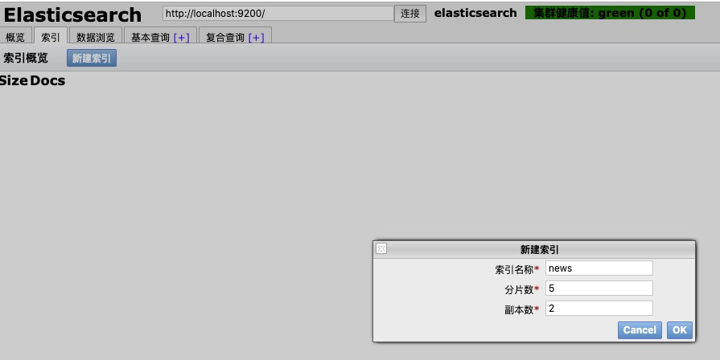
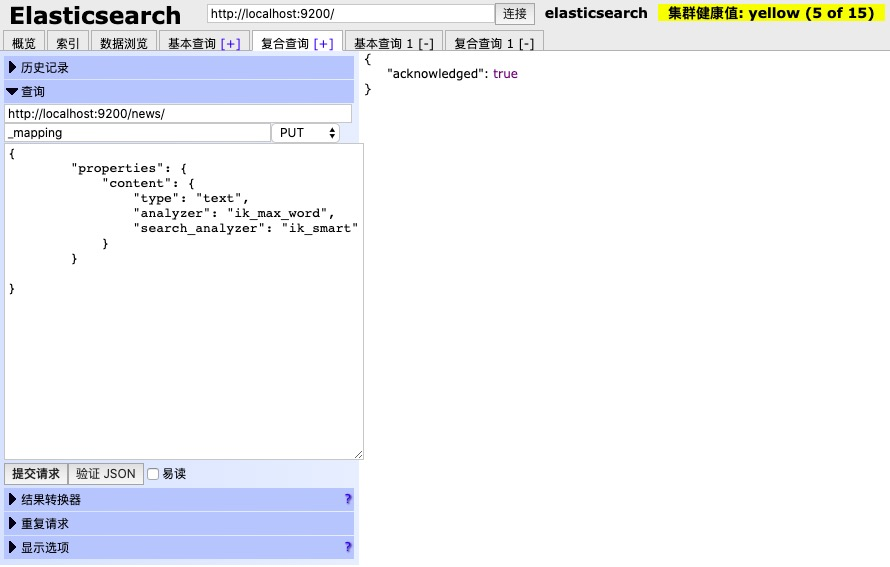
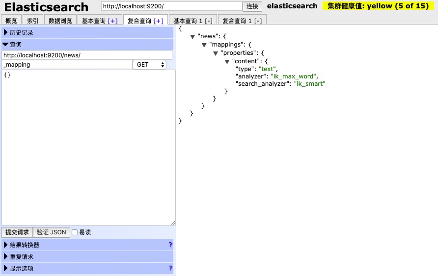
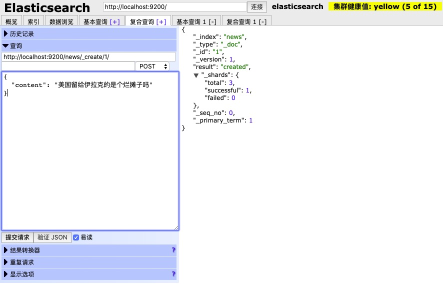
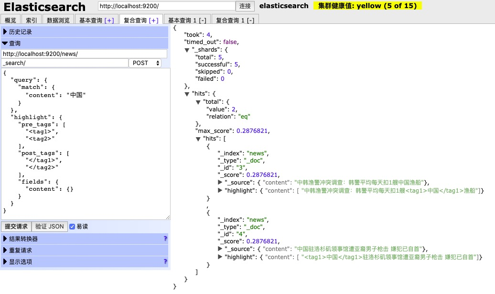
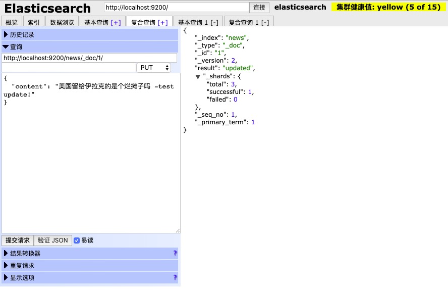
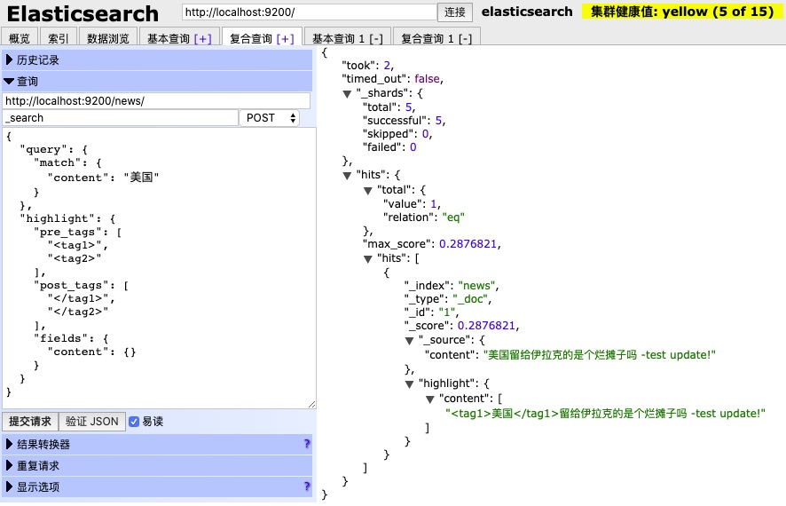
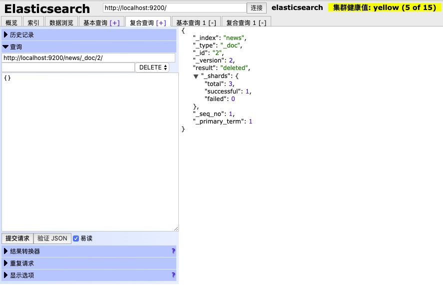

### 关于ES

ElasticSearch 是一个基于 Lucene 的搜索服务器。它提供了一个分布式多用户能力的全文搜索引擎，基于 RESTful web 接口。Elasticsearch 是用 Java 开发的，并作为 Apache 许可条款下的开放源码发布，是当前流行的企业级搜索引擎。设计用于云计算中，能够达到实时搜索。稳定，可靠，快速，安装使用方便。可以把ES当做是MongoDB来用, mongodb中也有全文搜索引擎，需要商业付费。

官网：https://www.elastic.co/
下载：https://www.elastic.co/cn/downloads/elasticsearch

### 配置

- 安装java sdk 并配置相应环境变量
- 下载 elasticsearch ：https://www.elastic.co/downloads/elasticsearch
- 运行 ElasticSearch
    * 下载完成 elasticsearch 包后，把 elasticsearch 包放在一个固定目录，然后从命令窗口 cd 到elasticsearch 包对应的目录，运行位于 bin 文件夹中的 elasticsearch.bat(windows举例)。这将会启动ElasticSearch 在控制台的前台运行，这意味着我们可在控制台中看到运行信息或一些错误信息。并可以使用 ctrl + c 停止或关闭它。
    * 当然最好将es配置到环境变量中去是最方便的了。
- 启动 ElasticSearch
    * 在启动过程中，ElasticSearch 的实例运行会占用大量的内存，所以在这一过程中，电脑会变得比较慢，需要耐心等待，启动加载完成后电脑就可以正常使用了。
- 访问 ElasticSearch Api
    * 当 ElasticSearch 的实例并运行，您可以使用 localhost:9200,基于 JSON 的 REST API 与 ElasticSearch 进行通信，如果输入 http://localhost:9200/ 出来如下类似数据，说明我们的ElasticSearch 配置并启动成功
		```json
		{
			"name": "Johnny",
			"cluster_name": "elasticsearch",
			"cluster_uuid": "ObwfDfnTTcWc8pyyiao6fQ",
			"version": {
			"number": "7.7.1",
			"build_flavor": "default",
			"build_type": "tar",
			"build_hash": "ad56dce891c901a492bb1ee393f12dfff473a423",
			"build_date": "2020-05-28T16:30:01.040088Z",
			"build_snapshot": false,
			"lucene_version": "8.5.1",
			"minimum_wire_compatibility_version": "6.8.0",
			"minimum_index_compatibility_version": "6.0.0-beta1"
			},
			"tagline": "You Know, for Search"
		}
		```

### 安装配置中文分词工具

- 默 认 情 况 ElasticSearch 只 适 用 于 英 文 分 词 ， 如 果 要 做 中 文 分 词 的 话 我 们 要 安 装 elasticsearch-analysis-ik 插件
- 官方文档：https://github.com/medcl/elasticsearch-analysis-ik
- 官方提供了两种安装中文分词工具的方法，具体见README，由于第二种可能因为版本问题会安装失败，所以接下来我们用第一种方式给大家安装。
- 安装配置中文分词工具
    * 下载中文分词工具
    * 在分词工具根目录创建 plugins/ik 文件
    * 把分词工具包的内容复制到 plugins/ik 文件里面
    * 修改配置文件的版本: 编辑`plugin-decriptor.properties` 修改`elasticsearch.version`同当前版本即可
    * 这样做不是百分百的可靠，但是大多数情况下都是可行的，最好是下载相同版本的es和中文分词插件
    * 安装完成中文分词插件后，重新启动 ElasticSearch

### Elasticsearch 中的一些概念

- 集群（cluster）
    * 代表一个集群，集群中有多个节点（node），其中有一个为主节点，这个主节点是可以通过选举产生的，主从节点是对于集群内部来说的。es 的一个概念就是去中心化，字面上理解就是无中心节点，这是对于集群外部来说的，因为从外部来看 es 集群，在逻辑上是个整体，你与任何一个节点的通信和与整个 es 集群通信是等价的。

- 索引（index）
    * ElasticSearch 将它的数据存储在一个或多个索引（index）中。用 SQL 领域的术语来类比，索引就像数据库，可以向索引写入文档或者从索引中读取文档，并通过ElasticSearch 内部使用 Lucene 将数据写入索引或从索引中检索数据。【可以把索引当做是数据库来看待】

- 文档（document）
    * 文档（document）是 ElasticSearch 中的主要实体。对所有使用 ElasticSearch的案例来说，他们最终都可以归结为对文档的搜索。文档由字段构成。【可以把文档当做是数据库的数据来看待】

- 映射（mapping）
    * 所有文档写进索引之前都会先进行分析，如何将输入的文本分割为词条、哪些词条又会被过滤，这种行为叫做映射（mapping）。一般由用户自己定义规则。【可以把映射看成是对索引和类型的配置】

- 类型（type）
    * 每个文档都有与之对应的类型（type）定义。这允许用户在一个索引中存储多种文档类型，并为不同文档提供类型提供不同的映射。【可以把类型当做是数据库的表来看待】
    * 注意：从ES 7.0.0 开始，type就被移除了，直接使用去掉type后官方推荐的方式进行操作
    * 参考：https://www.elastic.co/guide/en/elasticsearch/reference/master/removal-of-types.html#removal-of-types

- 分片（shards）
    * 代表索引分片，es 可以把一个完整的索引分成多个分片，这样的好处是可以把一个大的索引拆分成多个，分布到不同的节点上。构成分布式搜索。分片的数量只能在索引创建前指定，并且索引创建后不能更改。5.X 默认不能通过配置文件定义分片

- 副本（replicas）
    * 代表索引副本，es 可以设置多个索引的副本，副本的作用一是提高系统的容错性，当个某个节点某个分片损坏或丢失时可以从副本中恢复。二是提高 es 的查询效率，es 会自动对搜索请求进行负载均衡。 
 
- 数据恢复（recovery）
    * 代表数据恢复或叫数据重新分布，es 在有节点加入或退出时会根据机器的负载对索引分片进行重新分配，挂掉的节点重新启动时也会进行数据恢复。
    * GET /_cat/health?v  #可以看到集群状态

- 数据源（River）
    * 代表 es 的一个数据源，也是其它存储方式（如：数据库）同步数据到 es 的一个方法。它是以插件方式存在的一个 es 服务，通过读取 river 中的数据并把它索引到 es
中，官方的 river 有 couchDB 的，RabbitMQ 的，Twitter 的，Wikipedia 的，river这个功能将会在后面的文件中重点说到。

- 网关（gateway）
    * 代表 es 索引的持久化存储方式，es 默认是先把索引存放到内存中，当内存满了时再持久化到硬盘。当这个 es 集群关闭再重新启动时就会从 gateway 中读取索引数
据。es 支持多种类型的 gateway，有本地文件系统（默认），分布式文件系统，Hadoop的 HDFS 和 amazon 的 s3 云存储服务。

- 自动发现（discovery.zen）
    * 代表 es 的自动发现节点机制，es 是一个基于 p2p 的系统，它先通过广播寻找存在的节点，再通过多播协议来进行节点之间的通信，同时也支持点对点的交互。
    * 5.X 关闭广播，需要自定义

- 通信（Transport）
    * 代表 es 内部节点或集群与客户端的交互方式，默认内部是使用 tcp 协议进行交互，同时它支持 http 协议（json 格式）、thrift、servlet、memcached、zeroMQ 等的传输协议（通过插件方式集成）。
    * 节点间通信端口默认：9300-9400

- 分片和复制（shards and replicas）
    * 一个索引可以存储超出单个结点硬件限制的大量数据。
    * 比如，一个具有 10 亿文档的索引占据 1TB 的磁盘空间，而任一节点可能没有这样大的磁盘空间来存储或者单个节点处理搜索请求，响应会太慢。
    * 为了解决这个问题，Elasticsearch 提供了将索引划分成多片的能力，这些片叫做分片。
    * 当你创建一个索引的时候，你可以指定你想要的分片的数量。每个分片本身也是一个功能完善并且独立的“索引”,这个“索引” 可以被放置到集群中的任何节点上。
    * 分片之所以重要，主要有两方面的原因：
        * 允许你水平分割/扩展你的内容容量
        * 允许你在分片（位于多个节点上）之上进行分布式的、并行的操作，进而提高性能/吞吐量, 至于一个分片怎样分布，它的文档怎样聚合回搜索请求，是完全由 Elasticsearch 管理的，对于作为用户的你来说，这些都是透明的。
    * 在一个网络/云的环境里，失败随时都可能发生。在某个分片/节点因为某些原因处于离线状态或者消失的情况下，故障转移机制是非常有用且强烈推荐的。为此， Elasticsearch 允许你创建分片的一份或多份拷贝，这些拷贝叫做复制分片，或者直接叫复制。复制之所以重要，有两个主要原因：
        * 在分片/节点失败的情况下，复制提供了高可用性。复制分片不与原/主要分片置于同一节点上是非常重要的。因为搜索可以在所有的复制上并行运行，复制可以扩展你的搜索量/吞吐量
        * 总之，每个索引可以被分成多个分片。一个索引也可以被复制 0 次（即没有复制）或多次。一旦复制了，每个索引就有了主分片（作为复制源的分片）和复制分片（主分片的拷贝）。
        * 分片和复制的数量可以在索引创建的时候指定。在索引创建之后，你可以在任何时候动态地改变复制的数量，但是你不能再改变分片的数量。
        * 5.X 默认 5:1 5 个主分片，1 个复制分片
    * 默认情况下，Elasticsearch 中的每个索引分配 5 个主分片和 1 个复制。这意味着，如果你的集群中至少有两个节点，你的索引将会有 5 个主分片和另外 5 个复制分片（1 个完全拷贝），这样每个索引总共就有 10 个分片。

### 使用 RESTAPI 来操作 ElasticSearch

当 ElasticSearch 的实例并运行，您可以使用 localhost:9200, 基于 JSON 的 REST API 与ElasticSearch 进行通信。在 ElasticSearch 自己的文档中，所有示例都使用 curl。 但是，当使用 API 时也可使用图形客户端(如 Fiddler 或 RESTClient)，这样操作起更方便直观一些。浏览器也提供了操作 ElasticSearch 的插件，我们可以使用火狐浏览器里面提供的 ElasticSearch-Head。比如:火狐浏览器的 ElasticSearch-Head。当然在谷歌商店搜索ElasticSearch，也有相关的插件可以使用，非常方便。另外，听说 Chrome 插件 Sense。 Sense 提供了一个专门用于使用 ElasticSearch 的 REST API 的简单用户界面，不过这个没用过，还是推荐使用 ElasticSearch-Head 插件。

上述请求将执行最简单的搜索查询，匹配服务器上所有索引中的所有文档。针对ElasticSearch 运行，Sense 提供的最简单的查询，在响应结果的数据中并没有查询到任何数据，因为没有任何索引。如下所示 :

```json
{
    "took": 1,
    "timed_out": false,
    "_shards": {
        "total": 0,
        "successful": 0,
        "failed": 0
    },
    "hits": {
        "total": 0,
        "max_score": 0,
        "hits": []
    }
}
```

下一步我们来学习添加一些数据和索引，来修复这个问题。

先看看几个重要概念

<table>
    <tr>
        <td>索引</td>
        <td>数据库</td>
    </tr>
    <tr>
        <td>类型</td>
        <td>表</td>
    </tr>
        <tr>
        <td>文档</td>
        <td>数据</td>
    </tr>
    <tr>
        <td>映射</td>
        <td>对索引类型的配置</td>
    </tr>
</table>

**创建索引**

点击界面上的索引，新建索引, 如下图：(图片托管于github, 请确保网络的可访问性)

<div align="center">
  
</div>

这样索引就创建成功了，也就是类比数据库创建成功了，之后我们需要创建类型和映射，也就是表和配置信息

**创建类型以及配置映射**

如下图：(图片托管于github, 请确保网络的可访问性)

<div align="center">
  
</div>

```json
// PUT /news/_mapping
{ 
    "properties": { 
        "content": { 
            "type": "text", 
            "analyzer": "ik_max_word", 
            "search_analyzer": "ik_max_word"
        }
    }
}
```

这里news是索引, 这里使用post或者put都可以，_mapping可以放在上面，也可以放在下面(第二行, 如上图)

注意：关于analyzer

> ik_max_word 和 ik_smart 什么区别?
> ik_max_word: 会将文本做最细粒度的拆分，比如会将“中华人民共和国国歌”拆分为“中华人民共和国,中华人民,中华,华人,人民共和国,人民,人,民,共和国,共和,和,国国,国歌”，会穷尽各种可能的组合，适合 Term Query；
> ik_smart: 会做最粗粒度的拆分，比如会将“中华人民共和国国歌”拆分为“中华人民共和国,国歌”，适合 Phrase 查询

摘自README

全文搜索的原理是：对于一段文字, 把它差分成一个个的词，对这些词建立索引，速度快的原因是牺牲空间换时间

**查看映射**

如下图：(图片托管于github, 请确保网络的可访问性)

<div align="center">
  
</div>

```json
// GET /news/_mapping
{}
```

**增加数据**

如下图：(图片托管于github, 请确保网络的可访问性)

<div align="center">
  
</div>

```json
// POST /news/_create/1
{"content":"美国留给伊拉克的是个烂摊子吗"}

// 更多插入，如下：

// POST /news/_create/2
{"content":"公安部：各地校车将享最高路权"}

// POST /news/_create/3
{"content":"中韩渔警冲突调查：韩警平均每天扣1艘中国渔船"}

// POST /news/_create/4
{"content":"中国驻洛杉矶领事馆遭亚裔男子枪击 嫌犯已自首"}
```

使用_create来创建数据，后面的 1，2，3，4 都表示id, 当然可以用任意的一串字符串作为id也是可行的

**查询数据**

1.查询全部(注意：这里get，post都可以)

```json
// GET /news/_search
// POST /news/_search
```

2.条件查询(注意：这里只能post操作)
```json
// POST /news/_search
{
  "query": {
    "match": {
      "content": "中国"
    }
  },
  "highlight": {
    "pre_tags": [
      "<tag1>",
      "<tag2>"
    ],
    "post_tags": [
      "</tag1>",
      "</tag2>"
    ],
    "fields": {
      "content": {}
    }
  }
}
```

如下图：(图片托管于github, 请确保网络的可访问性)

<div align="center">
  
</div>

这里的tag标签可自定义，用于高亮显示搜索匹配的关键词，可替换成`<i></i>`, `<u></u>` 甚至任何你想用的字母组合`<xxx></xxx>`

**修改数据**

这里修改id为1的数据

```json
// PUT /news/_doc/1/
{
  "content": "美国留给伊拉克的是个烂摊子吗 -test update!"
}
```

注意：这里的 _doc 必须要填写，表示数据，下面的删除也是一个道理

如下图：(图片托管于github, 请确保网络的可访问性)

<div align="center">
  
</div>

查询测试，如下图：(图片托管于github, 请确保网络的可访问性)

<div align="center">
  
</div>

可以看到查询出来了，数据已经被成功修改

**删除数据**

删除id为2的数据

```json
// DELETE /news/_doc/2/
```

如下图：(图片托管于github, 请确保网络的可访问性)

<div align="center">
  
</div>

再次查询已经没有id为2的，那条"公安部：各地校车将享最高路权"数据了

### ES可视化工具 Kibana的使用

- 官网：https://www.elastic.co/cn/kibana 
- 下载：https://www.elastic.co/cn/downloads/kibana
- 配置：同ES, 最好加入环境变量中去，方便，不再赘述
- 更多：https://www.elastic.co/cn/webinars/kibana-lens-an-easy-intuitive-way-to-visualize-data