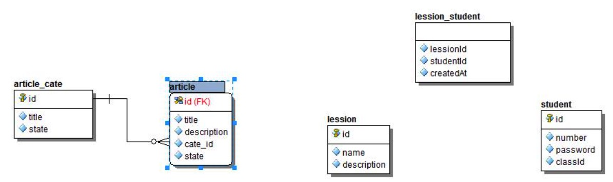

### 关于Sequelize

在一些较为复杂的应用中，我们可能会需要一个ORM框架来帮助我们管理数据层的代码。
而在 Node.js 社区中，sequelize 是一个广泛使用的 ORM 框架，它支持 MySQL、SQLite 和 MSSQL 、PostgreSQL 等多个数据源。

**相关文档**

- https://eggjs.org/zh-cn/tutorials/sequelize.html
- https://sequelize.org/

### Sequelize 操作 Mysql 数据库

**安装 egg-sequelize 以及 mysql2**

$ `npm i --save egg-sequelize mysql2`

**在 config/plugin.js 中引入 egg-sequelize 插件**

```js
exports.sequelize = { 
    enable: true,
    package: 'egg-sequelize',
};
```

**在 config/config.default.js 中编写 sequelize 配置**

```js
config.sequelize = { 
    dialect: 'mysql',
    host: '127.0.0.1', 
    port: 3306, 
    database: 'test', 
    username:"root", 
    password:"123456"
};
```

### Sequelize 操作 Mysql 实现增删改查

1.在 app/model/ 目录下编写数据库 Model, 以用户表 user 为例

```js
'use strict';

module.exports = app => {
    const { STRING, INTEGER, DATE } = app.Sequelize;
    const User = app.model.define('user', {
        id: { type: INTEGER, primaryKey: true, autoIncrement: true }, 
        name: STRING(255),
        age: INTEGER,
        created_at: DATE,
        updated_at: DATE,
    });
    return User; 
};
```

或

```js
'use strict';

module.exports = app => {
    const { STRING, INTEGER, DATE } = app.Sequelize;
    const User = app.model.define('user', {
        id: { type: INTEGER, primaryKey: true, autoIncrement: true }, 
        name: STRING(30),
        age: INTEGER,
        created_at: DATE,
        updated_at: DATE,
    },{
        freezeTableName: true,
        tableName: 'user_info', // 指定表名
        timestamps: false, // 表示：不自动增加创建时间
    });
    return User; 
};
```

注意：这里定义的model是user，对应数据库的表名就应该是users 复数的形式，第二种方式是自定义指定表名

2、定义 controller 实现数据库的增删改查

```js
async index() {
    const ctx = this.ctx;
    // ctx.body = await ctx.model.User.findAll();
    ctx.body = await ctx.model.User.findAll({limit: 10, offset: 0, order:[["id","desc"]]});
    // 指定返回的字段
    //ctx.body = await ctx.model.User.findAll({attributes: ['id', 'name'], limit: 10, order:[["id","desc"]]});
    // 查询条件
    //ctx.body = await ctx.model.User.findAll({attributes: ['id', 'name'], order:[["id","desc"]], where:{id:1}});
}

async findOne() {
    const ctx = this.ctx;
    var result = await ctx.model.User.findByPk(1); // 根据主键来查找数据
    ctx.body=result || ''; 
}

async create() {
    const ctx = this.ctx;
    const user = await ctx.model.User.create({ name:"张三", age:20 }); 
    ctx.status = 201;
    ctx.body = user;
}

async update() {
    const ctx = this.ctx;
    const id = 1;
    const user = await ctx.model.User.findByPk(id); 
    if (!user) {
        ctx.status = 404;
        return; 
    }
    await user.update({ name:"李四", age:43 });
    ctx.body = user;
}

async destroy() {
    const ctx = this.ctx;
    const id = 3;
    const user = await ctx.model.User.findByPk(id); 
    if (!user) {
        ctx.status = 404;
        return; 
    }
    await user.destroy(); 
    ctx.status = 200; 
    ctx.body="删除成功";
}
```

### Sequelize 操作多表关联查询

<div align="center">
    
</div>

**1 对 1 hasOne 或者 belongsTo**

文章和文章分类的关系是：一对一的关系，一篇文章对应一个分类，使用 `hasOne` ,  `belongsTo`

app/model/article.js

```js
'use strict';

module.exports = app => {
  const { STRING, INTEGER, DATE } = app.Sequelize;

  const Article = app.model.define('article', {
    id: { type: INTEGER, primaryKey: true, autoIncrement: true },
    title: STRING(255),
    description: INTEGER,
    cateId:STRING(30),
    state: DATE   
  },{
    timestamps: false,
    tableName: 'article'    
  });
 
  Article.associate = function (){
    // 1对1
    app.model.Article.belongsTo(app.model.ArticleCate, {foreignKey: 'cateId'});  // cateId 是 Article 表的外键
  }
 
  return Article;
};
```

app/controller/article.js

```js
  //查询数据 1对1
  async index() {
    const { ctx } = this;

    let result = await ctx.model.Article.findAll({
        include: {
          model: ctx.model.ArticleCate
        }
    });

    ctx.body = result;
  }
```


**一对多 hasMany**

文章分类和文章的关系是：一对多的关系，一篇文章对应一个分类，使用 `hasMany`

app/model/article_cate.js

```js
'use strict';

module.exports = app => {
  const { STRING, INTEGER, DATE } = app.Sequelize;

  const ArticleCate = app.model.define('article_cate', {
    id: { type: INTEGER, primaryKey: true, autoIncrement: true },
    title: STRING(255),
    state: INTEGER
  },{
    timestamps: false,  //关闭时间戳
    tableName: 'article_cate'    //配置表名称 
  });

  ArticleCate.associate = function (){
    // 如果是 1对1 的话就像是下面这样写
    // app.model.ArticleCate.hasOne(app.model.Article, {foreignKey: 'cateId'});

    // 文章分类与文章是 1对多，应该这样
    app.model.ArticleCate.hasMany(app.model.Article, {foreignKey: 'cateId'});
  }
 
  return ArticleCate;
};
```

app/controller/article.js

```js
  //查询数据 1对多
  async index() {
    const { ctx } = this;

    let result = await ctx.model.ArticleCate.findAll({
        include: {
          model: ctx.model.Article
        }
    });

    ctx.body = result;
  }

```

**多对多 belongsToMany**

有三张表：其中两张表：课程表和学生表；另外一张关联表：学生课程的关联表

app/model/lesson.js

```js
'use strict';

module.exports = app => {
    const { INTEGER, STRING } = app.Sequelize;
 
    const Lesson = app.model.define('lesson', {
        id: {
            type: INTEGER,
            primaryKey: true,
            autoIncrement: true
        },
        name: {
            type: STRING,
            allowNull: false
        }
    },{
        timestamps: false,
        tableName: 'lesson'    
      });

      Lesson.associate = function () {
        //一个学生可以选修多门课程 
        //一门课程可以被多个学生选修
        app.model.Lesson.belongsToMany(app.model.Student, {
            through: app.model.LessonStudent, 
            foreignKey: 'lessonId',//注意写法 
            otherKey: 'studentId' 
        });
     }
    return Lesson;
}

```

app/model/student.js

```js
'use strict';

module.exports = app => {
    const { STRING, INTEGER } = app.Sequelize;

    const Student = app.model.define('student', {
        id: {
            type: INTEGER,
            autoIncrement: true,
            primaryKey: true
        },
        name: {
            type: STRING,
        },
        number: {
            type: STRING,
            allowNull: false,
        },
        password: {
            type: STRING(32),
            allowNull: false
        }
    }, {
        timestamps: false,
        tableName: 'student'
    });

    Student.associate = function () {
        //一个学生可以选修多门课程
        app.model.Student.belongsToMany(app.model.Lesson, {
            through: app.model.LessonStudent, // through 关联表
            foreignKey: 'studentId',// 注意写法 驼峰
            otherKey: 'lessonId' 
        });
    }

    return Student;
}

```

app/model/lesson_student.js

```js
'use strict';

module.exports = app => {
    const { INTEGER } = app.Sequelize;
 
    const LessonStudent = app.model.define('lesson_student', {
        lessonId: {
            type: INTEGER,
            primaryKey: true
        },
        studentId: {
            type: INTEGER,
            primaryKey: true
        }
    },{
        timestamps: false,
        tableName: 'lesson_student'    
      });
 
    //   LessonStudent.associate = function(){
 
    // }
 
    return LessonStudent;
}
```

控制器 app/controller/test.js 查询语句:

```js
async index() {
    const { ctx } = this;

    // 查询课程有哪些学生选修：
    // let result = await ctx.model.Lesson.findAll({
    //   include: {
    //     model:  ctx.model.Student
    //   }
    // });
    

    // 查询每个学生选修了哪些课程
    let result = await ctx.model.Student.findAll({
      include: {
        model:  ctx.model.Lesson
      }
    });   
    ctx.body = result;
}

```

### Sequelize 常见的数据类型

<table>
    <tr>
        <td>Sequelize.STRING</td>
        <td>VARCHAR(255)</td>
    </tr>
    <tr>
        <td>Sequelize.STRING(1234)</td>
        <td>VARCHAR(1234)</td>
    </tr>
    <tr>
        <td>Sequelize.STRING.BINARY</td>
        <td>VARCHAR BINARY</td>
    </tr>
    <tr>
        <td>Sequelize.TEXT</td>
        <td>TEXT</td>
    </tr>
    <tr>
        <td>Sequelize.TEXT('tiny')</td>
        <td>TINYTEXT</td>
    </tr>
    <tr>
        <td>Sequelize.INTEGER</td>
        <td>INTEGER</td>
    </tr>
    <tr>
        <td>Sequelize.BIGINT</td>
        <td>BIGINT</td>
    </tr>
    <tr>
        <td>Sequelize.BIGINT(11)</td>
        <td>BIGINT(11)</td>
    </tr>
    <tr>
        <td>Sequelize.FLOAT</td>
        <td>FLOAT</td>
    </tr>
    <tr>
        <td>Sequelize.FLOAT(11)</td>
        <td>FLOAT(11)</td>
    </tr>
    <tr>
        <td>Sequelize.FLOAT(11, 12)</td>
        <td>FLOAT(11,12)</td>
    </tr>
    <tr>
        <td>Sequelize.DOUBLE</td>
        <td>DOUBLE</td>
    </tr>
    <tr>
        <td>Sequelize.DOUBLE(11)</td>
        <td>DOUBLE(11)</td>
    </tr>
    <tr>
        <td>Sequelize.DOUBLE(11, 12)</td>
        <td>DOUBLE(11,12)</td>
    </tr>
    <tr>
        <td>Sequelize.DECIMAL</td>
        <td>DECIMAL</td>
    </tr>
    <tr>
        <td>Sequelize.DECIMAL(10, 2)</td>
        <td>DECIMAL(10,2)</td>
    </tr>
    <tr>
        <td>Sequelize.DATE</td>
        <td> DATETIME 针对 mysql / sqlite; TIMESTAMP, WITH TIME ZONE 针对 postgres</td>
    </tr>
    <tr>
        <td>Sequelize.DATE(6)</td>
        <td>// DATETIME(6) 针对 mysql 5.6.4+. 小数秒支持多达6位精度</td>
    </tr>
    <tr>
        <td>Sequelize.DATEONLY</td>
        <td>DATE 不带时间</td>
    </tr>
    <tr>
        <td>Sequelize.BOOLEAN</td>
        <td>TINYINT(1)</td>
    </tr>
</table>